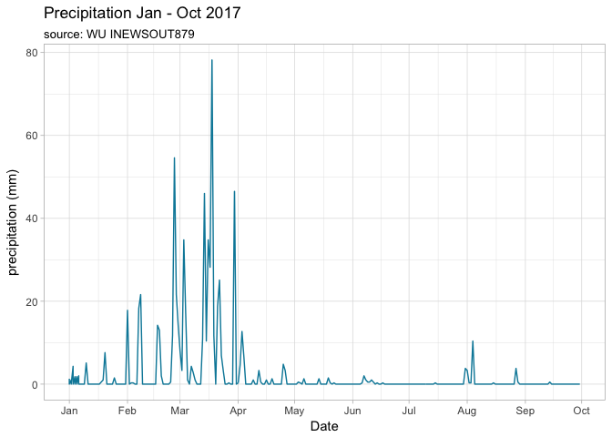

# Winter rainfall in Sydney 2017
Neil Saunders  
compiled `r Sys.time()`  


# Introduction
It feels like the winter and spring of 2017 in Sydney were exceptionally dry. Does data back up this feeling?

# Read and transform the data
Unfortunately, `rwunderground::history_range()` is returning NA values for many variables, including rainfall:


```
## Observations: 37,231
## Variables: 19
## $ date       <dttm> 2017-06-01 00:03:00, 2017-06-01 00:08:00, 2017-06-...
## $ temp       <dbl> 8.6, 8.5, 8.4, 8.3, 8.2, 8.2, 8.2, 8.1, 8.0, 7.9, 7...
## $ dew_pt     <dbl> 2.3, 2.3, 2.5, 2.3, 2.5, 2.4, 2.6, 2.5, 2.4, 2.5, 2...
## $ hum        <dbl> 65, 65, 66, 66, 67, 67, 68, 68, 68, 69, 69, 69, 70,...
## $ wind_spd   <dbl> 0, 0, 0, 0, 0, 0, 0, 0, 0, 0, 0, 0, 0, 0, 0, 0, 0, ...
## $ wind_gust  <dbl> 0, 0, 8, 8, 0, 0, 0, 0, 0, 0, 0, 0, 0, 0, 0, 0, 0, ...
## $ dir        <chr> "North", "North", "NW", "NW", "North", "North", "No...
## $ vis        <dbl> NA, NA, NA, NA, NA, NA, NA, NA, NA, NA, NA, NA, NA,...
## $ pressure   <dbl> 1029.3, 1029.3, 1029.3, 1029.3, 1029.3, 1029.3, 102...
## $ wind_chill <dbl> NA, NA, NA, NA, NA, NA, NA, NA, NA, NA, NA, NA, NA,...
## $ heat_index <dbl> NA, NA, NA, NA, NA, NA, NA, NA, NA, NA, NA, NA, NA,...
## $ precip     <dbl> NA, NA, NA, NA, NA, NA, NA, NA, NA, NA, NA, NA, NA,...
## $ cond       <chr> NA, NA, NA, NA, NA, NA, NA, NA, NA, NA, NA, NA, NA,...
## $ fog        <dbl> NA, NA, NA, NA, NA, NA, NA, NA, NA, NA, NA, NA, NA,...
## $ rain       <dbl> NA, NA, NA, NA, NA, NA, NA, NA, NA, NA, NA, NA, NA,...
## $ snow       <dbl> NA, NA, NA, NA, NA, NA, NA, NA, NA, NA, NA, NA, NA,...
## $ hail       <dbl> NA, NA, NA, NA, NA, NA, NA, NA, NA, NA, NA, NA, NA,...
## $ thunder    <dbl> NA, NA, NA, NA, NA, NA, NA, NA, NA, NA, NA, NA, NA,...
## $ tornado    <dbl> NA, NA, NA, NA, NA, NA, NA, NA, NA, NA, NA, NA, NA,...
```

So data for the Hornsby personal weather station (INEWSOUT879) was copy-pasted from the Weather Underground website into a text file, so requires some additional processing.


# Plot the data
<!-- -->

# Conclusion
Very little significant rainfall was measured between April and the beginning of October. So yes: our feeling that "it hasn't rained for months" is correct.
